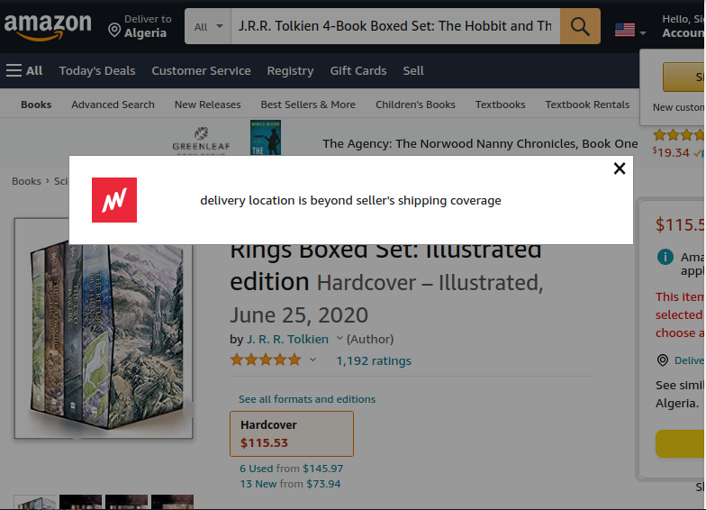
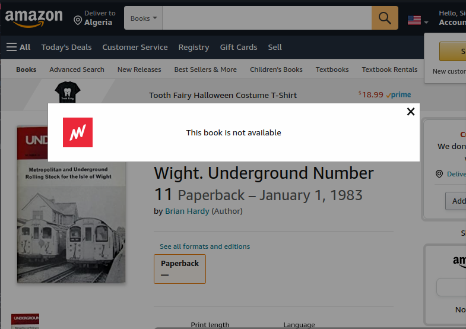
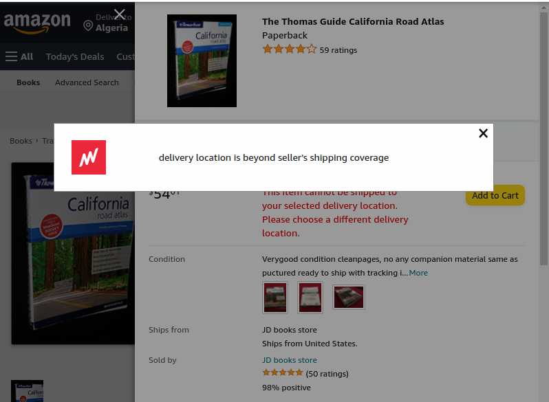

# Matterway JS Engineer Tech Challenge

This is a tech challenge for the [Matterway](https://www.matterway.io/) JavaScript team.

The challenge is to automate the process of choosing a random book from a selected genre and proceed to the checkout page to purchase the book on Amazon.

## Environment

- Node v16.12.0
- Yarn v1.22.17

## Instructions

1. Install the dependencies

   yarn

2. Build the application

   yarn build

3. Run the application

   yarn start

## Screenshots

1. Location
   

1. No Buying Options
   

1. NotAvailable
   

1. SeeAllOptionD
   

1. Normal checkout
   
